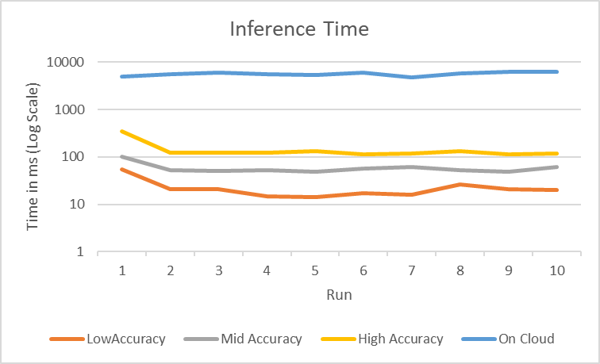
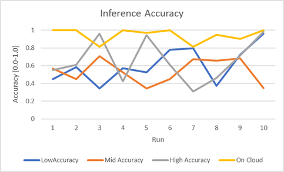
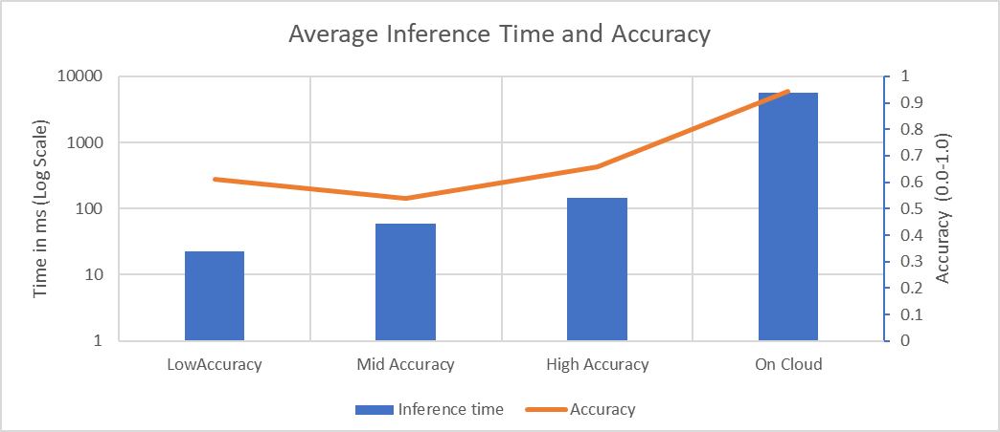

## Metrics
We are measuring inference time of the deep learning model on device and the accuracy of the model. We are comparing it across three different deep learning models, one low latency and low accuracy (MobileNets_0.25_144) another with high accuracy and high latency (MobileNets_1.0_224) and another with moderate accuracy and latency (MobileNets_0.50_244). The time taken is measured around the tflite.run() statement. This is only a time measurment of the model running not including any file saving or loading. 
The team did not measure battery consumption differences between the models as we felt that would be negligable. 

## Results
Time taken for each model:

Accuracy of each model:

Average of the models:

The higher the accuarcy of the model the more time it took to return a response. There are some issues with the accuracy of the low level model as it's accuracy is higher than expected. However, while the low accuarcy model was more sure of its prediction, the overall prediction was incorrect more often.
These graphs show that the higher accuracy model was more accurate overall than the mid and low level models, with a negliable additional amount of response latency. However the accuracy and correctness of the on-cloud model is not to be challenged as it was overall the most accurate. To optimize our application we would choose the high accuracy model for the on device and keep the on cloud one. 

## Data Collected
Time is measured in milliseconds, accuracy is measured from 0.0 - 1.0

Mid Accuracy Model
    Test 1-
        Time:100ms
        Accuracy:0.5670
    Test 2-
        Time:53ms
        Accuracy:0.4504
    Test 3-
        Time:51ms
        Accuracy:0.7054
    Test 4-
        Time:52ms
        Accuracy:0.5236
    Test 5-
        Time:48ms
        Accuracy:0.3431
    Test 6-
        Time:58ms
        Accuracy:0.4502
    Test 7-
        Time:62ms
        Accuracy:0.6753
    Test 8-
        Time:52ms
        Accuracy:0.6576
    Test 9-
        Time:49ms
        Accuracy:0.6820
    Test 10-
        Time:61ms
        Accuracy:0.3477
        
Low Accuracy Model
    Test 1-
        Time:54ms
        Accuracy:0.4509
    Test 2-
        Time:21ms
        Accuracy:0.5830
    Test 3-
        Time:21ms
        Accuracy:0.3451
    Test 4-
        Time:15ms
        Accuracy:0.5706
    Test 5-
        Time:14ms
        Accuracy:0.5241
    Test 6-
        Time:17ms
        Accuracy:0.7796
    Test 7-
        Time:16ms
        Accuracy:0.7956
    Test 8-
        Time:26ms
        Accuracy:0.3719
    Test 9-
        Time:21ms
        Accuracy:0.7221
    Test 10-
        Time:20ms
        Accuracy:.9622
        
High Accuracy Model
    Test 1-
        Time:345ms
        Accuracy:0.5517
    Test 2-
        Time:124ms
        Accuracy:0.6101
    Test 3-
        Time:121ms
        Accuracy:0.9597
    Test 4-
        Time:122ms
        Accuracy:0.4256
    Test 5-
        Time:131ms
        Accuracy:0.9438
    Test 6-
        Time:115ms
        Accuracy:0.6083
    Test 7-
        Time:118ms
        Accuracy:0.3074
    Test 8-
        Time:135ms
        Accuracy:0.4621
    Test 9-
        Time:116ms
        Accuracy:0.7162
    Test 10-
        Time:118ms
        Accuracy:0.9845
        
Cloud mid Accuracy Model
    Test 1-
        Time:4899ms
        Accuracy:.9998
    Test 2-
        Time:5557ms
        Accuracy:.9999
    Test 3-
        Time:6105ms
        Accuracy:.8136
    Test 4-
        Time:5651ms
        Accuracy:0.9999
    Test 5-
        Time:5280ms
        Accuracy:.9714
    Test 6-
        Time:5937ms
        Accuracy:0.9999
    Test 7-
        Time:4779ms
        Accuracy:.8118
    Test 8-
        Time:5883ms
        Accuracy:.9498
    Test 9-
        Time:6276ms
        Accuracy:.9021
    Test 10-
        Time:6308ms
        Accuracy:0.9994